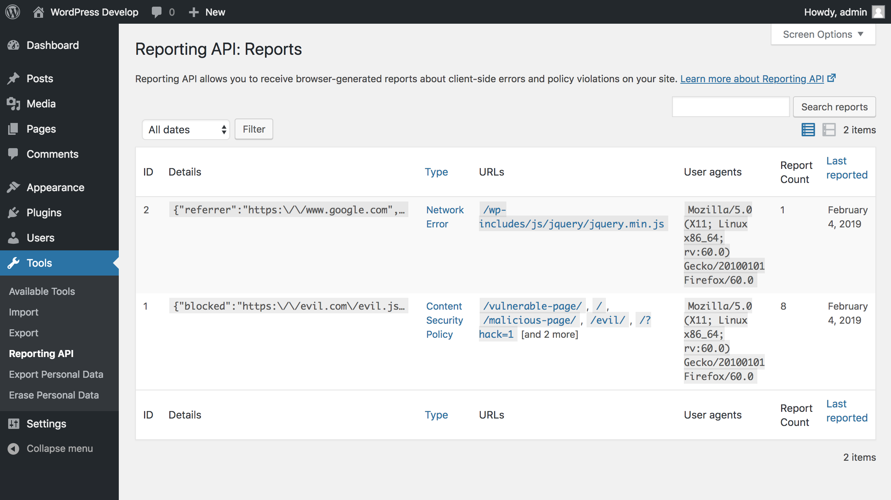

# Reporting API

WordPress plugin for receiving browser reports via a Reporting API endpoint.

## Details

As [noted on the Google Developers blog](https://developers.google.com/web/updates/2018/09/reportingapi):

> The Reporting API defines a new HTTP header, `Report-To`, that gives web developers a way to **specify server endpoints** for the browser to send warnings and errors to. Browser-generated warnings like CSP violations, Feature Policy violations, deprecations, browser interventions, and network errors are some of the things that can be collected using the Reporting API.

This plugin provides a storage mechanism and endpoint for browser reports according to the Reporting API spec in WordPress, as well as an admin interface for browsing these reports. It also provides an API for sending the `Report-To` response headers.

As the Reporting API specification is still evolving and at an early stage, the plugin reflects that and is currently an experimental prototype, to demonstrate how Reporting API can be used in WordPress.

### Did you know?

There is also a new specification called Feature Policy which will integrate with the Reporting API specification. There is a [WordPress plugin for Feature Policy](https://github.com/GoogleChromeLabs/wp-feature-policy) as well.

## Requirements

* WordPress >= 4.7
* PHP >= 5.6

## Contributing

Any kind of contributions to Reporting API are welcome. Please [read the contributing guidelines](https://github.com/GoogleChromeLabs/wp-reporting-api/blob/master/CONTRIBUTING.md) to get started.

## Further Resources

* [https://developers.google.com/web/updates/2018/09/reportingapi](https://developers.google.com/web/updates/2018/09/reportingapi)
* [https://w3c.github.io/reporting/](https://w3c.github.io/reporting/)
* [https://github.com/w3c/reporting](https://github.com/w3c/reporting)
